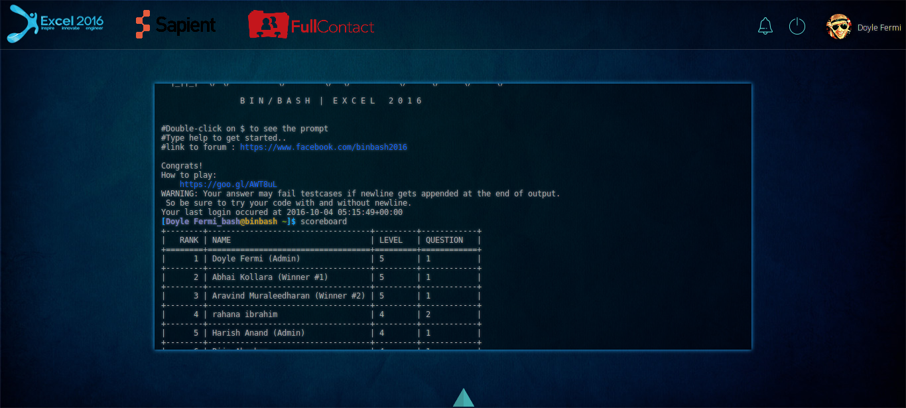

# BINBASH API#
----
  Perform GET and POST requests to play `excel2016/binbash`

  # IMPORTANT CALLS #

API :
* All response are in JSON format having `status` set to either `Success` or `Failure`.
* Example of a response { "status" : "Success" , "result" : "welcome to binbash" }
* If it is a `Success` then `result` has to be displayed to the binbash terminal as output.
* If the status is a `Failure`, an internal error occured and its has `reason` parameter which shouldn't be displayed to terminal {its for debug}.
* Failure response dont have `result` value and therefore nothing should be shown to user. Only `Success ` calls should be shown.

### 1st call :  CREATING USER AND START BINBASH
* URL:

    http://localhost:8000/request/?user_id=username&create=true&name=username

    Provide the `username` to user_id and also set create=true to create a user. If create=true is not provided, `"status": "Failure"` occurs.

    Also provide `name` as another GET parameter for computing ranklist.

* Response:

        {  
           "status": "Success",
           "level": 1,
           "question": 1,
           "question_info": "",
           "result": "Welcome to #!/bin/bash\r\n\r\nThe world of programming is in a standstill. All open source programing languages have been closed. \r\n\r\nWell... All except bash. An organization has dismantled the entire GNU community and forced them to enforce proprietary ownership.\r\n \r\nYour task is to help free the open source languages using bash scripting.\r\nEnter the command ‘help’ to understand the rules of the game. \r\nFirst, let’s test your basic bash scripting.\r\nPress any key to begin..."
        }

Just print the `result` to terminal.

###### NOTE (DONT SKIP)

1.  A call to http://localhost:8000/request/?user_id=username&create=true&name=username must be made when a user logs in, even if the user has been already created. This call is necessary to store log-in time. So make the call with create=true set, and there wont be any user created but you will receive a `Success` reply with `result` and that result can be displyed to terminal initially.

### 2nd call:  ALL COMMANDS THAT USER TYPES IN THE TERMINAL
* URL:

    1. http://localhost:8000/request/?user_id=username&cmd=whoami
    2. http://localhost:8000/request/?user_id=username&cmd=ls
    3. http://localhost:8000/request/?user_id=username&cmd=cat%20question.txt
    4. http://localhost:8000/request/?user_id=username&cmd=help
    5. http://localhost:8000/request/?user_id=username&cmd=scoreboard
    6. http://localhost:8000/request/?user_id=username&cmd=anything_else

    Must provide `user_id` and `cmd`
    * cmd is the command the user gives.

* Response:

        {
            "status": "Success",
            "result": "file.txt question.txt testcase.txt answer.sh"
        }

    Print the `result` to terminal if status is `Success`

#### 6*. SCOREBOARD CALL HAS SPECIAL RESPONSE

* This call has only user_id as there is no name in the backend. Response has user_id and is in sorted order.
* URL:

    http://localhost:8000/request/?user_id=username&cmd=scoreboard
* Response:

       {    
            "status": "Success",
            "result count": 3,
            "result": "NAME\t\tLEVEL\t\tQUESTION\t\tLAST CORRECT ANSWER TIME\ndoylefermi\t\t3\t\t2\t\t2016-09-24 18:59:34+00:00\ntestuser1\t\t1\t\t2\t\t2016-09-23 21:51:40+00:00\nusername\t\t1\t\t2\t\t2016-09-24 18:40:46+00:00\n",
            "result_json": {
                "0": ["name", "level_no", "question_no", "last submitted correct answers timestamp"],
                "1": ["doylefermi", 3, 2, "2016-09-24T18:59:34Z"],
                "2": ["testuser1", 1, 2, "2016-09-23T21:51:40Z"],
                "3": ["username", 1, 2, "2016-09-24T18:40:46Z"]
            }
        }

     Notes:
    *  `"result count"` means “no of players”.
    *  `“result_json”` is another json with 0th element denoting contents in each column

### 3rd call:  FILE SUBMISSION: A POST REQUEST WITH THE FILE
* URL:

    localhost:8000/request/?user_id=username&cmd=submit

    Call is same as before with command being `submit` and the differnce being a `POST` call has to be made to that url only.

        POST parameter :
            1. file : uploaded file

    Example of a successful call :

        curl --form file=@/home/harish/anyname.sh http://localhost:8000/request/?user_id=username\&cmd=submit
* Response:

        {
              "status": "Success",
              "result": "Success on test cases\nTestcase input: 10\n\nYour output: 6\n",
              "md5": "f30039df1312661857e7b33297585010"
        }

 Display `result` as output to the terminal.

 If testcases has failed, still the `status` will be `Success` and you can display the `result` which test case failure details.    

 ### 4th call:  RANK  OF A USER
 * URL:

         http://localhost:8000/rank/?user_id=doylefermi
* Response:
*
        {"status": "Success", "result": 1}
